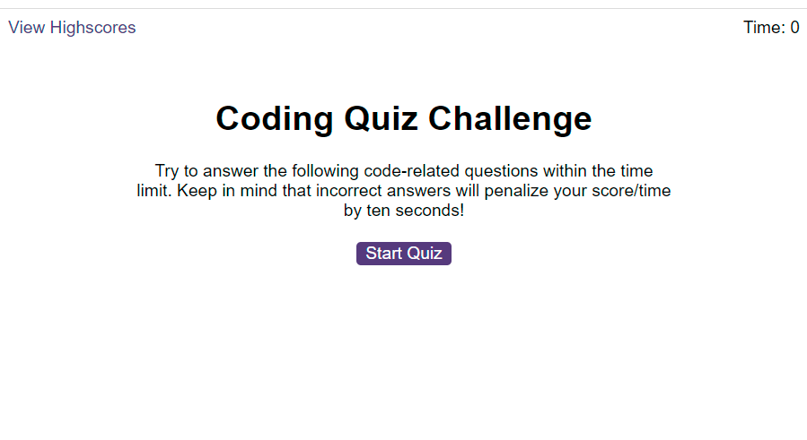
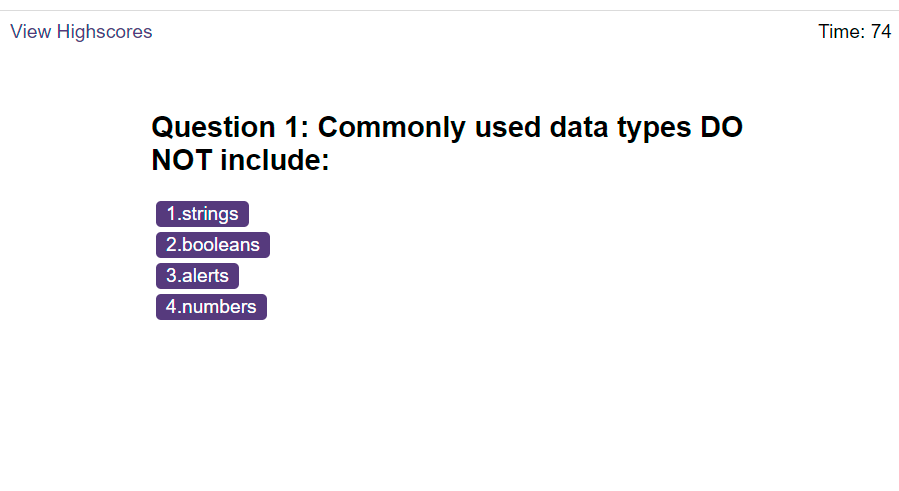
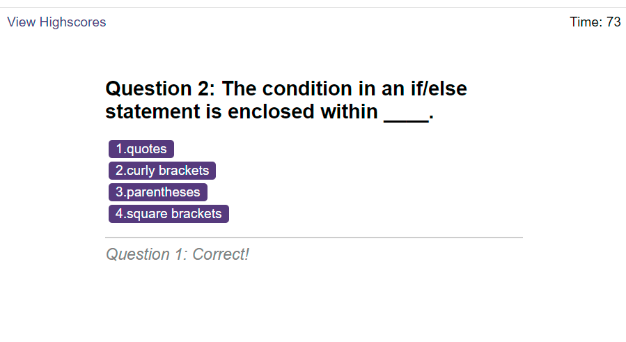
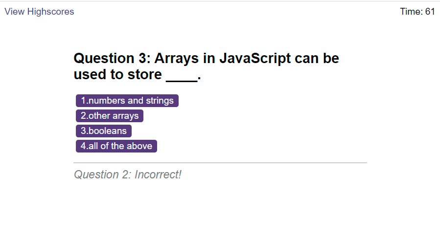
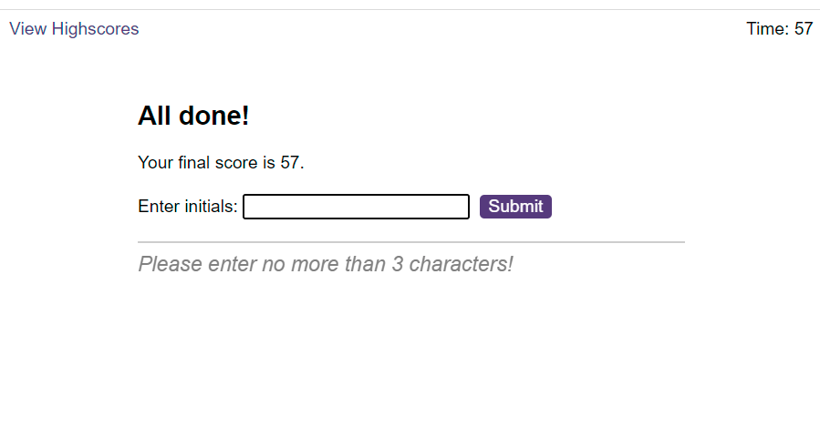
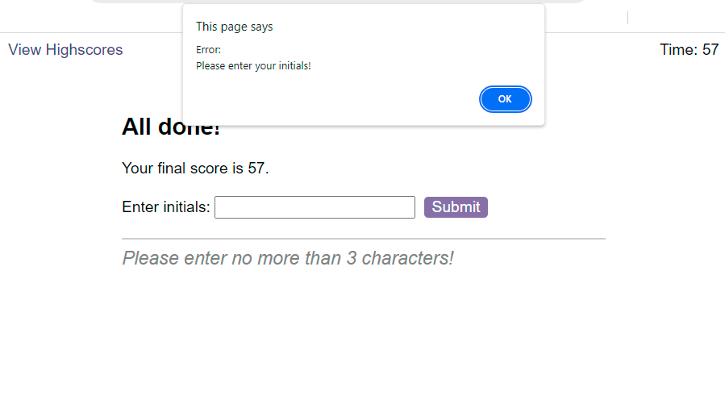
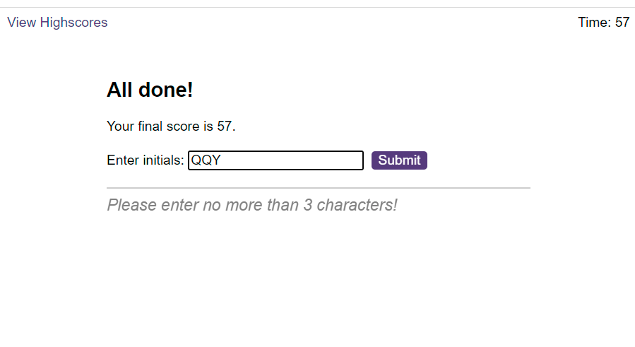
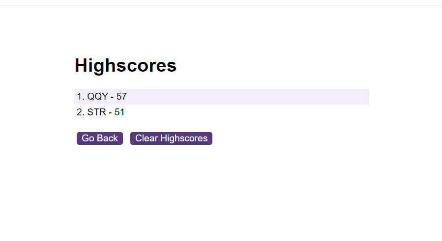
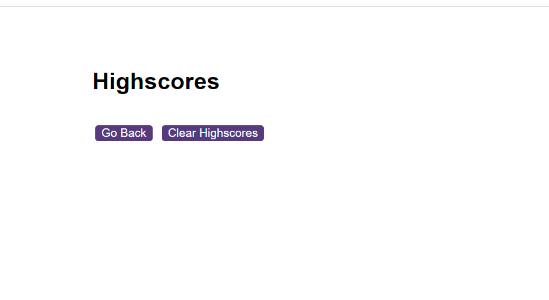
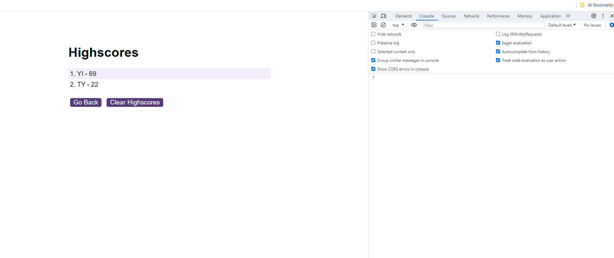

# Code-Quiz-JS
Module 6 Challenge Web APIs: Code Quiz

## Description 

This Code-Quiz-JS was created for bootcamp students who were taking the sixth week's challenge. In this challenge, my task was to create a code quiz that contains the following requirements:

* A start button that when clicked a timer starts and the first question appears. 
  * Questions contain buttons for each answer.
  * When answer is clicked, the next question appears
  * If the answer clicked was incorrect then subtract time from the clock
* The quiz should end when all questions are answered or the timer reaches 0.
  * When the game ends, it should display their score and give the user the ability to save their initials and their score

## Installation

N/A

## Usage 

To use Code-Quiz-JS,  you can review each file. 

To check whether the application meets critical requirements, open the webpage [Code Quiz](https://qingh2o.github.io/Code-Quiz-JSt/). 

Once the Code-Quiz-JS web page loads, the application should look similar to the screenshot below.

### User flow with images

* Display the first question and start timing at 75 seconds after the user clicks the "Start Quiz" button.

* Display feedback message and next question after the user selects answer.

    * If the answer is correct show the feedback for the previous question and play the matching audio.
    
    * If the answer is incorrect, display feedback from the previous question and play the matching audio, subtracting 10 seconds from the clock.
    
* Display the user's score and let the user save their initials and score after the game ends.

* Alert an error message when the user enters nothing or types spaces.

* Set input up to 3 characters.

* Display the high score list after the user submits.

* Display the start screen after the user select "Go Back" button.

* Display a descending list of high scores after the user completes another game.

* Display the start screen after the user select "Go Back" button.

* Display a descending list of high scores after the user clicks the "View Highscores" link.

* Display an empty list of high scores after the user clicks the "Clear Highscores" button.

### Inspect page using Chrome DevTools

Open Chrome DevTools by right-clicking the page and selecting "Inspect". An Elements panel should open either below or to the side of the webpage in the browser. Click on the Console to see if there are any errors.

The "Inspect" page should look similar to the screenshot below.

## Credits

N/A

## License

Please refer to the LICENSE in the repo.
